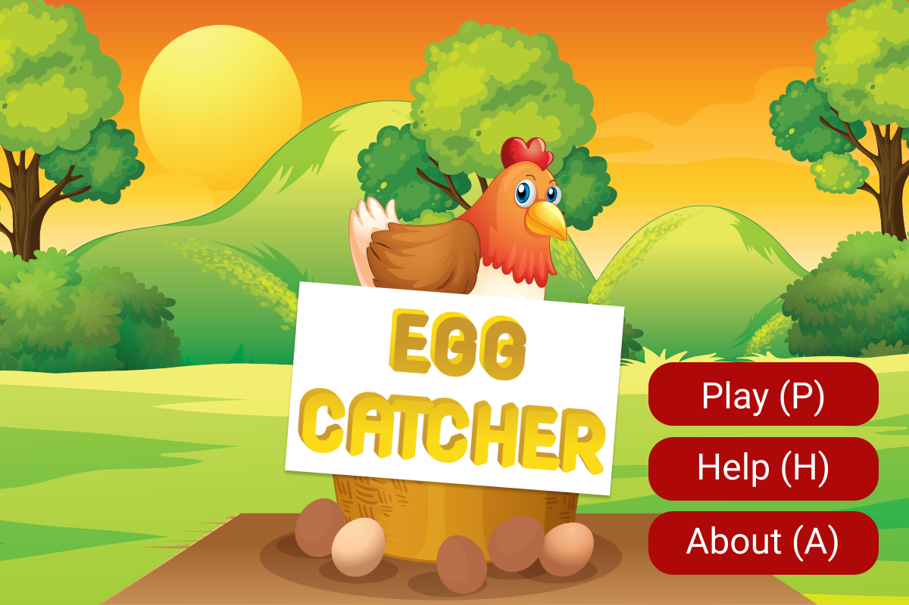
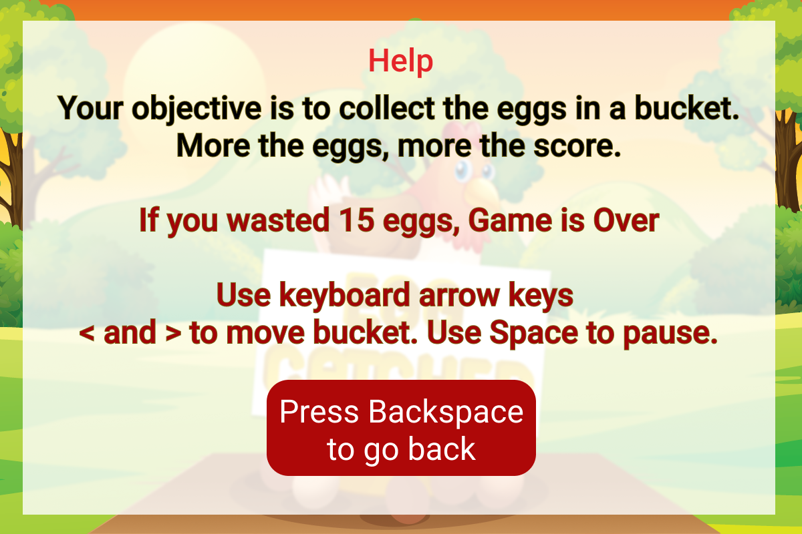
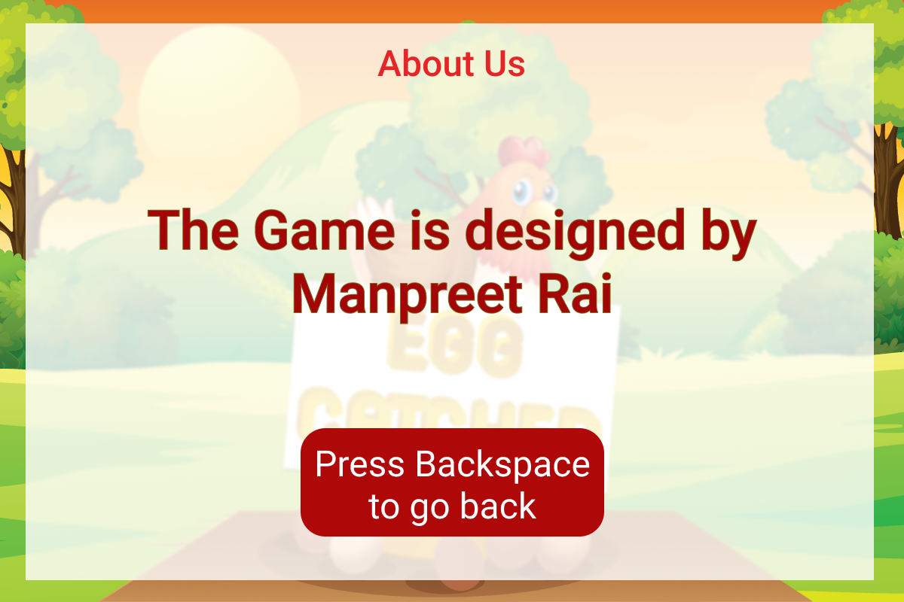
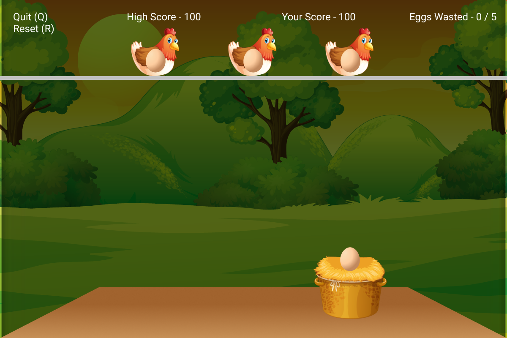

# Egg Catcher
A game for kids to play on Microsoft Windows

## How to download and play?
### Game needs .Net Core 3.1
[Download .NET Core Here](https://dotnet.microsoft.com/en-us/download/dotnet/3.1)
Choose **Windows x64 | x86** based on your system.

### Then install the game using any of these two options:
- Click on **EggCatcher.exe** and then **View Raw**. It will download the game to your Downloads folder.
- OR use the **releases** section on this page and download the **EggCatcher.exe** file

Next install the downloaded **`EggCatcher.exe`**. This will create a desktop shortcut, that you can use to play this game.

## Technologies Used
- Visual Studio 2019
- C#
- [Monogame (Game Engine)](https://monogame.net/)

### Screenshots
#### Launcher

#### Help

#### About

#### Gameplay

## Licence
You are free to play and share this game.

Ⓒ Copyright 2021 Manpreet Rai.
